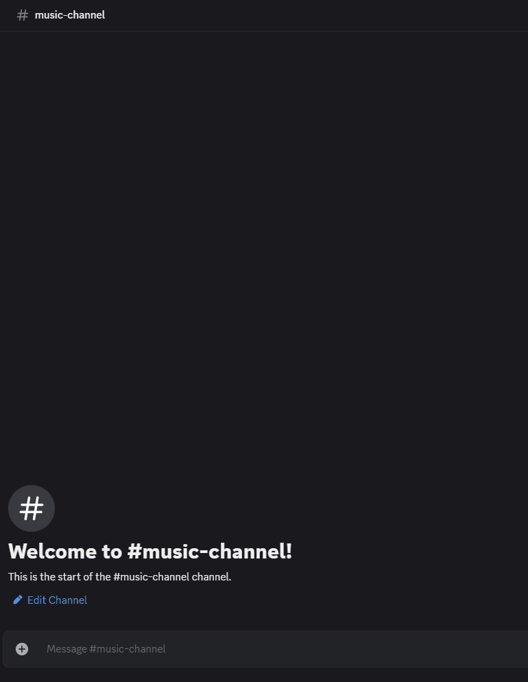

# 🎶 Bora– Your Discord Music Sidekick

**Bora** is a lightweight JDA Discord music bot with clean-sharp audio, AI-powered queue expansion, and support for _all your songs_.

---

## 🚀 Features

- 🔍 **YouTube Music Search** – find “all your songs”  
- 🔗 **Link Source Support** – SoundCloud, Deezer, YouTube, YandexMusic  
- 🔀 **Shuffle** – mix up your queue  
- 🤖 **Bora AI Queue** – auto-expand your playlist with similar tracks  
- 🔊 **Clean, Sharp Audio**  
- ▶️ Basic commands: play, pause, stop, skip, ai playlist, now playing, queue  
- 📱 Responsive – joins/leaves on demand  

---

## 🎵 Usage

Type these in your server:

| Command        | Description                          |
| -------------- | ------------------------------------ |
| `/play <query>`| Search & play song/playlist/link     |
| `/pause`       | Pause playback                       |
| `/resume`      | Resume playback                      |
| `/skip`        | Skip current track                   |
| `/leave`       | Clear queue & leave                  |
| `/shuffle`     | Shuffle the queue                    |
| `/queue`       | Show upcoming tracks                 |

---

## 🤝 Contributing

1. Fork it  
2. Create your feature branch (`git checkout -b feature/awesome`)  
3. Commit your changes (`git commit -m 'Add awesome feature'`)  
4. Push to the branch (`git push origin feature/awesome`)  
5. Open a PR  

---

    
  

> *Named in tribute to Bora Čorba – iconic frontman of Riblja Čorba, whose voice defined generations.*
